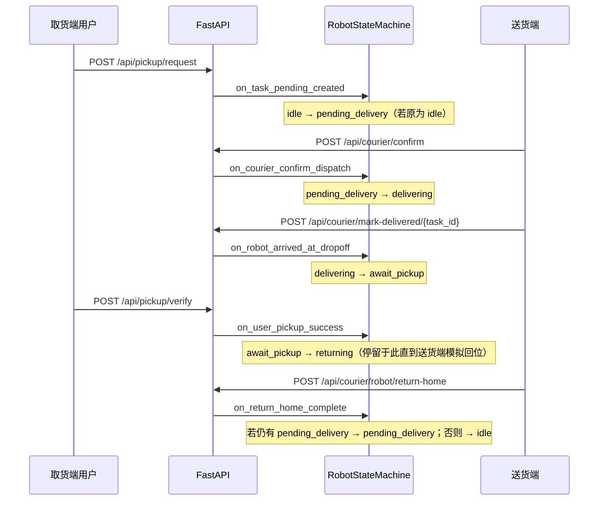

# 楼内送/取货系统 — 本地调试工程

在 PC 上跑通业务逻辑与状态机，小车与 ROS2 未接入时用 HTTP API 代替。

## 目录说明

| 路径 | 说明 |
|------|------|
| `backend/` | FastAPI + SQLite：用户、任务、通知、机器人状态机 |
| `user_client/` | **取货端 PC 版（Kivy）**：双列控制台布局，适合桌面/平板 |
| `user_client_mobile/` | **取货端手机版（Kivy）**：Bottom Nav 五页（首页/任务/机器人/消息/我的） |
| `courier_client/` | **送货端（Kivy）**：队列、确认投件、标记送达、复位状态机；与取货端同一技术栈，便于 PC 与 **arm64 Ubuntu 20.04** 上 `pip install kivy` 后直接运行 |
| `onboard_client/` | **车载集成端（Kivy 横屏）**：导览 + 送货顶栏双状态、Tab 分页、互斥提示；`ONBOARD_MODE=local` 纯本地测时序，`api` 联 FastAPI/MQTT |
| `car_ui/` | 入口说明（实际 UI 在 `courier_client`） |
| `frontend/` | 可选 Web 占位 |
| `assets/fonts/` 与各客户端 `assets/fonts/` | 中文字体（`scripts/download_fonts.py` 会同步到 `user_client`、`courier_client`） |
| `scripts/download_fonts.py` | 下载 Noto Sans CJK 简体 Regular（约 16MB） |

## 环境

- Windows / Ubuntu：Python 3.11+（Ubuntu arm64 同样可用 pip 安装依赖）
- 建议虚拟环境：`python -m venv .venv` 后激活

## 安装与字体

```powershell
pip install -r requirements.txt
python scripts\download_fonts.py
```

Linux：

```bash
pip install -r requirements.txt
python scripts/download_fonts.py
```

## 启动后端

```powershell
cd backend
python -m uvicorn main:app --reload --host 0.0.0.0 --port 8000
```

手机或其它电脑访问时，用户端 / 送货端里填 `http://<本机局域网IP>:8000`。

## 启动取货端

项目根目录：

**PC / 平板（控制台布局）：**

```powershell
python -m user_client.main
```

**手机（Bottom Navigation）：**

```powershell
python -m user_client_mobile.main
```

默认 API：`PICKUP_API_BASE` 环境变量，未设置时为 `http://127.0.0.1:8000`。手机版在「我的」页配置 API 地址。

## 启动送货端

项目根目录：

```powershell
python -m courier_client.main
```

默认 API：`COURIER_API_BASE`，否则 `PICKUP_API_BASE`，否则 `http://127.0.0.1:8000`。

送货端调用 `GET /api/courier/queue`、`POST /api/courier/confirm` 等；与历史路径 `POST /api/dev/*` **同一套业务逻辑**（后者仍保留兼容）。

## 启动车载集成端（导览 + 送货）

项目根目录，默认 **1280×720 横屏**，顶栏常显导览/送货状态与互斥提示；主区 Tab 切换（送货 | 导览）。

```powershell
# 默认即为 api 联调（须先启动 backend，取货用 user_client，不要用车载端模拟取货）
cd backend
python -m uvicorn main:app --host 0.0.0.0 --port 8000

# 终端 2：取货端
python -m user_client.main

# 终端 3：车载集成端（导览障碍仍为模拟按钮）
python -m onboard_client.main

# 仅练导览状态机、不连后端
$env:ONBOARD_MODE="local"
python -m onboard_client.main

# PC 左右分栏调试
$env:ONBOARD_DEBUG_SPLIT="1"
python -m onboard_client.main
```

**本地联调建议流程**：取货端发起取货 → 车载端确认投件 →（可选）开导览并验证不可投件 → 结束导览 → 标记送达 → 取货端确认取货 → 车载端模拟回位。导览「模拟障碍/取消」仍在车载端；**取货请求与密码取货仅由 user_client 完成**。

**导览 + 真车（与送货共用 MQTT 桥）**：房间表来自 **主** `ros_ws/.../switcher_node.py`（`GET /api/building/rooms`，路径由 `AI_CAR_ROS_WS` 或同级 `Desktop/ros_ws` / 车上 `~/Desktop/rock_ws/ros_ws` 自动解析）。流程：选房间 → `tour_nav` → 到站后点 **「确认到达并返航」**（或 **「确认取消导览」**）→ 全局机器人 **returning** + MQTT `tour_return_home` 回 100；返航完成 → **idle** 或 **pending_delivery**（有待投件任务时）。返回中 **仅可取货请求**，不可投件/新导览。障碍仍为 UI 模拟。

联真车时另设 `MQTT_BRIDGE_ENABLED=1` 等（见下文 B 方案）。`courier_client` 仍可单独运行。

**送货端界面会约每 2.5 秒自动请求一次队列与 `GET /api/robot/state`**，这样在 **取货端完成「确认取货」** 后，不必手动点刷新也能看到 **`returning（返回中）`**。若你误以为点「标记送达」就应进入返回中，需注意：**到达站点后是 `await_pickup（待取货）`**，**返回中**仅在用户输入密码确认取货之后。

### B 方案：独立服务器 + 车端 ROS（MQTT 桥，已内置）

1. **车机**：运行 `smart_nav_manager` 的 `switcher_node`（与 `ros_ws` 一致），`robot_id` 与 broker 须与服务器环境变量一致。  
2. **服务器**：`pip install -r requirements.txt` 后，在 `backend` 目录：

```powershell
$env:MQTT_BRIDGE_ENABLED="1"
$env:MQTT_ROBOT_ID="robot01"
$env:MQTT_BROKER_HOST="broker.emqx.io"
$env:MQTT_BROKER_PORT="1883"
python -m uvicorn main:app --host 0.0.0.0 --port 8000
```

（Linux 用 `export MQTT_BRIDGE_ENABLED=1` 等。）**建议 `--workers 1`**，避免并发两条 MQTT 事务交错。

3. **联调约束**：启用桥后，用户下单时的 **`door_plate` 必须等于车上导航房间号**（如 `101`、`203`，与 `switcher_node` 中 `DELIVERY_ROOM_IDS` 一致）；服务端自动生成的 **6 位投件码** 会作为 MQTT 的 `phone_tail` 发给车端。  
4. **HTTP 行为变化摘要**：  
   - `POST /api/pickup/request`：写库后发 `pickup_request`，等车端 `pickup_ack`；失败则回滚任务。  
   - `POST /api/courier/confirm`：先发 `courier_dropoff` 再发 `confirm_delivery`，成功后再把任务标为 `delivering`。  
   - 车到房间后由车端发 `task_status: waiting_receipt`，后端自动把对应任务改为 `await_pickup`（「标记送达」可改为等待自动同步，或继续点一次轮询）。  
   - `POST /api/pickup/verify`：先发 MQTT `confirm_receipt`，再落库 `completed`。  
   - `POST /api/courier/robot/return-home`：在 MQTT 模式下会 **阻塞等待** 车端心跳出现 `delivery_waiting` + `nav_state=IDLE`（最长约 240s），再执行内存里的 `on_return_home_complete`。  
5. **诊断**：`GET /api/bridge/status` 与 `GET /api/robot/state` 中的 `mqtt` 字段可看 broker、连接与最近心跳摘要。  
6. **未设置 `MQTT_BRIDGE_ENABLED`**：行为与原先纯本地 SQLite + 内存状态机一致。

## 时序逻辑（任务状态 × 机器人状态 × API）

便于排查：下列「机器人状态」指内存中的 **全局单例** `RobotStateMachine`（`GET /api/robot/state`），与 SQLite 里 **任务行** 的 `tasks.status` 是两套概念，必须对照着看。

### 任务状态（`tasks.status`）

| 值 | 含义 |
|----|------|
| `pending_delivery` | 用户已下单，等送货员投件 |
| `delivering` | 已确认投件，途中 |
| `await_pickup` | 已送达站点，等用户密码取货 |
| `completed` | 用户取货成功 |

### 机器人状态（内存 `robot_state`）

| 值 | 含义 |
|----|------|
| `idle` | 初态 |
| `pending_delivery` | 有待投件队列时的对外状态（由「有待投件任务 + 曾从 idle 切入」等规则驱动） |
| `delivering` | 送货中 |
| `await_pickup` | 货到站，等用户取 |
| `returning` | 用户已取货，小车返回中（见下文 **重要说明**） |

### 推荐 happy path（单任务）



### 「模拟回位」按钮（送货端）在做什么？

旧版 **`POST /api/courier/robot/reset`** 曾 **`force_set(idle)`**，与数据库里仍存在的 **待投件** 任务不一致，会导致「列表里有任务却不能投件」。  

当前语义：

1. **`POST /api/courier/robot/return-home`**（送货端按钮「模拟回位」）：仅在机器人处于 **`returning`** 时生效，调用 `on_return_home_complete(still_has_pending)`：  
   - 若 SQLite 中仍存在 **`pending_delivery`** 任务 → 机器人 **`pending_delivery`**（可继续投件）；  
   - 否则 → **`idle`**。  
2. **`POST /api/courier/robot/reset`** 与 **`POST /api/dev/robot/reset`**：与 **return-home** 相同（兼容旧脚本）。  
3. **`POST /api/courier/debug/clear-all-tasks`**（送货端「清空全部任务」）：删除 **全部任务与通知**，机器人强制 **`idle`**（极端调试）。  

确认取货成功后，响应 JSON 含 **`robot_state`**（应为 **`returning`**）；此后须在送货端点 **模拟回位**，才能回到 **`idle` / `pending_delivery`**。

### 排查清单

1. **确认取货后无法再次投件**：看 `GET /api/robot/state` 是否为 **`returning`** → 需先 **模拟回位**。  
2. **报错「当前机器人不在返回中」**：说明内存状态不是 **`returning`**（例如尚未确认取货、或刚清空数据库）。  
3. **任务已是 `completed`，但怀疑机器人状态不对**：查 `GET /api/robot/state` 与送货端展示的中文状态。  
4. **报错「状态机未处于待取货」**：机器人未处于 **`await_pickup`**（常见：未「标记送达」、顺序错乱）。  
5. **任务状态与机器人不一致**：机器人状态仅在进程内存；**重启后端** 后为 **`idle`**，需重新按序模拟或后续做持久化（未实现）。

## 本地联调流程（无小车）

1. **取货端**：注册（用户名 + 登录密码）→ 登录 → 发起取货请求（仅门牌，服务端返回 **6 位投件码**）。  
2. **送货端**：刷新队列 → 输入投件码 → **确认投件** → 输入任务 ID → **标记货物已送达**。  
3. **取货端**：刷新 → 「到站取货」输入任务 ID + **登录密码** → **确认取货**（机器人进入 **返回中**）。  
4. **送货端**：**模拟回位**（仍有待投件则进入 **待投件**，否则 **初态**）。  

（调试）送货端 **清空全部任务与通知** 会删库内任务并强制 **初态**。

## 打 APK（WSL / Linux + Buildozer）

Buildozer **不支持在 Windows 原生环境直接打包**，请使用 **WSL2 Ubuntu** 或实体 Linux/arm64 机器。

### 打开与安装 WSL（Windows 10/11）

**第一次使用**（需管理员 PowerShell 或「终端(管理员)」）：

```powershell
wsl --install
```

默认会安装 **Ubuntu** 和 WSL2。执行后**重启电脑**，再按提示创建 Linux 用户名和密码。

若已装过 WSL 但还没有 Ubuntu：

```powershell
wsl --list --online          # 查看可安装的发行版
wsl --install -d Ubuntu      # 安装 Ubuntu
```

**日常打开 WSL**（任选一种）：

| 方式 | 操作 |
|------|------|
| 开始菜单 | 搜索并打开 **Ubuntu** 或 **Windows Subsystem for Linux** |
| PowerShell / CMD | 输入 `wsl` 或 `wsl -d Ubuntu` 回车 |
| Windows Terminal | 新建标签页 → 选择 **Ubuntu**（推荐，可开多标签） |
| Cursor / VS Code | 终端面板下拉 → 选择 **Ubuntu (WSL)** |

**检查是否 WSL2**（在 PowerShell 中）：

```powershell
wsl -l -v
```

`VERSION` 应为 `2`。若为 `1`，可执行：

```powershell
wsl --set-version Ubuntu 2
```

**进入本项目目录** — 注意 **两种终端、两种路径**，不要混用：

| 你在哪 | 提示符大致长什么样 | 进项目目录 |
|--------|-------------------|------------|
| **WSL / Ubuntu（bash）** | `user@PC:~$` | `cd /mnt/d/cd/RTTH-update/UI` |
| **Windows PowerShell** | `PS C:\...>` 或 `PS ...>` | `cd D:\cd\RTTH-update\UI` |

**正确做法（推荐）**：在 PowerShell 里先进入 Linux，再 `cd`：

```powershell
wsl -d Ubuntu-22.04
```

看到 bash 提示符（如 `yourname@...:~$`）**之后**再执行：

```bash
cd /mnt/d/cd/RTTH-update/UI
pwd
```

也可一行命令（不进入交互 shell）：

```powershell
wsl -d Ubuntu-22.04 -e bash -c "cd /mnt/d/cd/RTTH-update/UI && pwd && ls"
```

**常见错误**：提示符是 `PS Microsoft.PowerShell.Core\FileSystem::\\wsl.localhost\...>` 时，说明仍在 **PowerShell 浏览 WSL 目录**，此时输入 `/mnt/d/...` 会报「拒绝访问」或「找不到路径」。请先输入 `wsl` 或 `wsl -d Ubuntu-22.04` 进入 bash。

发行版名称以 `wsl -l -v` 为准（可能是 `Ubuntu`、`Ubuntu-22.04` 等），`-d` 后面填实际名称。

> Windows 资源管理器地址栏 `\\wsl.localhost\Ubuntu-22.04\` 仅用于浏览文件；**Buildozer 打包请在 bash 里执行**，路径用 `/mnt/d/...`。

### 0. 准备资源（在 Windows 或 WSL 的项目根目录 `UI/`）

```bash
pip install -r requirements.txt
python scripts/download_fonts.py
```

确认存在字体（约 16MB）：

- `user_client/assets/fonts/NotoSansCJKsc-Regular.otf`
- `user_client_mobile/assets/fonts/NotoSansCJKsc-Regular.otf`

### 1. WSL 内安装系统依赖（Ubuntu 22.04 示例）

```bash
sudo apt update
sudo apt install -y \
  git zip unzip openjdk-17-jdk python3-pip python3-venv \
  autoconf libtool pkg-config zlib1g-dev libncurses5-dev \
  libncursesw5-dev libtinfo5 cmake libffi-dev libssl-dev
pip install buildozer cython
```

首次 `buildozer android debug` 会自动下载 Android SDK/NDK（体积大、耗时长，需稳定网络）。

### 2. 打包手机取货端（NovaJoy Mobile）

**重要：不要在 `/mnt/d/` 或 `/mnt/c/` 上直接运行 buildozer。**  
项目在 Windows 盘上时，WSL 无法正确设置 Linux 权限与符号链接，`pythonforandroid.toolchain create` 等步骤会失败（日志末尾只显示 Command failed，真正原因在更上方）。

**推荐：一键脚本（复制到 Linux 目录再打包，完成后 APK 回到 Windows 盘）**

在 **bash**（`wsl -d Ubuntu-22.04` 进入后）执行：

```bash
cd /mnt/d/cd/RTTH-update/UI    # 按你的实际 D: 路径改
bash scripts/build_mobile_apk_wsl.sh
```

脚本会：同步代码到 `~/novajoy-ui-build` → 在 ext4 上 `buildozer android debug` → 把 `bin/*.apk` 复制回 `user_client_mobile/bin/`。

**手动方式（等价）**

```bash
rsync -a --exclude '.buildozer' /mnt/d/cd/RTTH-update/UI/ ~/novajoy-ui-build/
cd ~/novajoy-ui-build/user_client_mobile
buildozer android debug
mkdir -p /mnt/d/cd/RTTH-update/UI/user_client_mobile/bin
cp bin/*.apk /mnt/d/cd/RTTH-update/UI/user_client_mobile/bin/
```

若曾在 `D:` 盘上失败过，可先删掉损坏的缓存再跑脚本：

```bash
rm -rf /mnt/d/cd/RTTH-update/UI/user_client_mobile/.buildozer
```

成功产物：

```text
user_client_mobile/bin/novajoypickup-0.1.0-arm64-v8a-debug.apk
```

安装到已开启 USB 调试的手机（在 **Linux 构建目录** 或复制 APK 后）：

```bash
adb install -r user_client_mobile/bin/*.apk
# 或在 ~/novajoy-ui-build/user_client_mobile 内: buildozer android deploy run logcat
```

### 2.1 打包失败排查

| 现象 | 原因 | 处理 |
|------|------|------|
| `Command failed: pythonforandroid.toolchain create` | 在 `/mnt/d/` 上构建，或**下载依赖失败** | 用 `scripts/build_mobile_apk_wsl.sh`；日志里搜 `Traceback` / `RemoteDisconnected` |
| `[Errno 13] Permission denied` | 在 `/mnt/d/` 上构建 | 同上 |
| `RemoteDisconnected` / `Connection reset` 下载 openssl | 访问 openssl.org / GitHub 不稳定 | 脚本会预下载；或手动：`bash scripts/prefetch_p4a_packages.sh` 后重跑 |
| `No main.py(c) found in your app directory` | `source.main` 指向子目录时 p4a 仍要求根目录有 `main.py` | 已用仓库根 `main.py` + `source.main = main.py` |
| `build-arm64-v8a_armeabi-v7a` 与 spec 不一致 | 复用了旧 distribution（双架构） | `buildozer android clean` 或删 `.buildozer` 后重跑 |
| 下载 SDK/NDK 极慢 | 网络/代理 | WSL 内配置 `http_proxy` 或使用稳定网络 |

### 3. 打包 PC 取货端 / 送货端（可选）

```bash
cd ../user_client && buildozer android debug    # 旧版 PC 布局 APK
cd ../courier_client && buildozer android debug # 送货端 APK
```

| 目录 | buildozer.spec | 说明 |
|------|----------------|------|
| `user_client_mobile/` | 手机 Bottom Nav 五页 | **推荐真机用户** |
| `user_client/` | PC 双列控制台 | 平板/大屏 |
| `courier_client/` | 送货调度 | 送货员 |

### 4. 真机联调

- 手机与电脑同一 WiFi；在 App「我的」页填 `http://192.168.x.x:8000`（电脑局域网 IP）。
- 电脑防火墙放行 8000 端口；后端：`cd backend && python -m uvicorn main:app --host 0.0.0.0 --port 8000`。
- 手机 APK 已配置 `usesCleartextTraffic` 以便 HTTP 内网联调；**公网上架请改 HTTPS 并去掉该属性**。
- 模拟器访问本机：`http://10.0.2.2:8000`。

### 5. 发布版（签名）

```bash
buildozer android release
# 需配置 [app] 段 ios/android 签名；见 Buildozer 文档
```

文档：[Buildozer](https://buildozer.readthedocs.io/) · [python-for-android](https://python-for-android.readthedocs.io/)

### 真机与 HTTP

- 真机填电脑局域网 IP；Android 9+ 对明文 HTTP 有限制，内网联调见前文或改用 HTTPS。  
- 模拟器访问本机后端可用 `http://10.0.2.2:8000`。

## 机器人与手机：HTTP 还是 MQTT？

- **Android 完全可以做局域网调试**：同一 WiFi 下填 `http://192.168.x.x:8000` 即可；若失败多为 **防火墙 / 明文 HTTP 策略**，不是「安卓不能本地测」。  
- **MQTT 很适合机器人侧**：车端、边缘网关用 **局域网或公网 MQTT Broker**（如 Mosquitto 跑在 Ubuntu arm64 上）发状态、收指令，**低带宽、易离线缓存、主题清晰**。  
- **常见组合**：手机 App 仍走 **HTTPS REST**（注册、任务、通知）；后端或网关在收到 REST 后 **向 MQTT 发布「去某门牌」**；机器人 **订阅 MQTT 执行**，再通过 MQTT/HTTP **回传状态**。把「业务真相」放在服务端，MQTT 只做车端传输层，便于以后换 5G / 专网而不改 App 流程。

当前仓库以 **HTTP API** 为主；设置 `MQTT_BRIDGE_ENABLED=1` 时 **MQTT 桥在 `backend` 进程内** 与 `switcher_node` 对齐，无需单独桥接进程。

## 需要对齐的业务细节（可选）

- 匹配键与取货密码的约束。  
- 待取货超时策略。  
- 多机器人任务分配。  
- 为 `/api/courier/*` 增加鉴权（令牌 / 设备证书），再暴露到公网。
