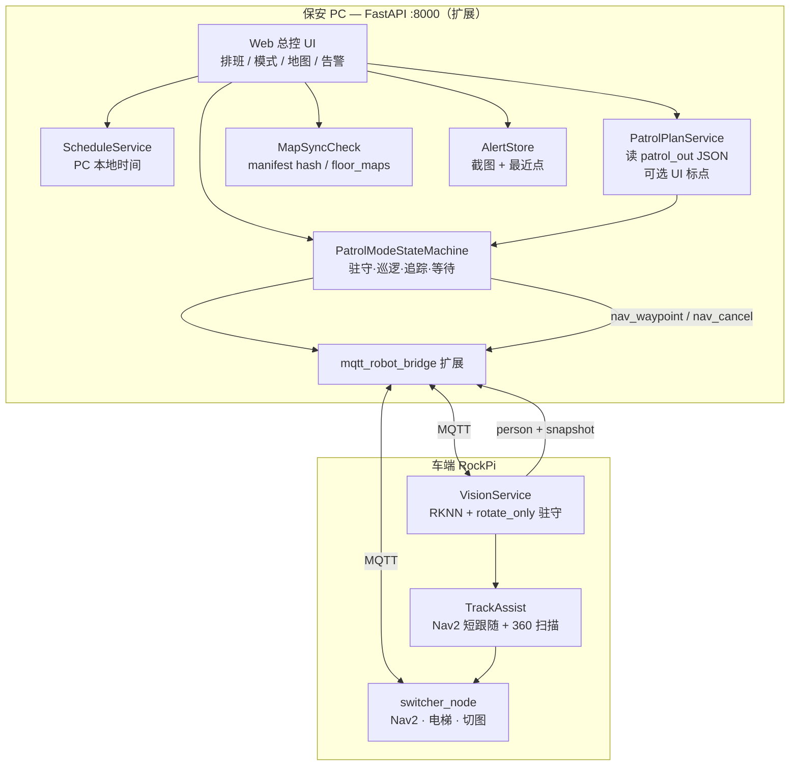
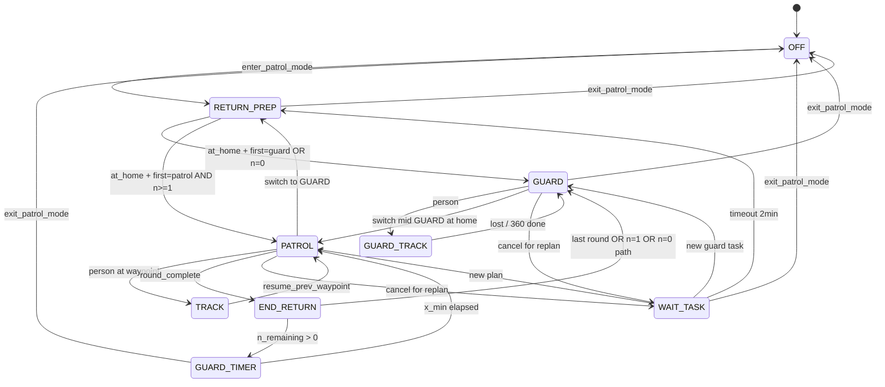

# 保安/总控端 · 巡逻模式 — 实施计划（P1）

> **版本：** v0.1 对齐稿  
> **基线代码：** `002-630`  
> **视觉参考：** `待更新/person_tracker`（仅 rotate_only 驻守 + 检测管线；巡逻追踪走 Nav2）  
> **状态：** 待浏览确认后开工  
> **日期：** 2026-06-30  

---

## 1. 一句话目标

在 **保安 PC 的后端（扩展现有 `:8000` FastAPI）** 上新增 **Web 总控 UI**，统一管理：

- 手动 / 定时 **进入·退出巡逻模式**
- **驻守 / 巡逻 / 追踪** 状态机
- **巡逻路径规划、下发、地图预览与最近点闪烁**
- **人检告警（JPEG 框图 + 浏览器提示音）**

**车端** 负责：Nav2 执行导航点、RKNN 人检、心跳与截图上传；**不在车端跑独立 `:8002` 总控服务**（原 `master_control` 仅作历史参考）。

---

## 2. 已锁定决策（不再讨论）

| ID | 决策 |
|----|------|
| 部署 | 保安 PC = 后端 PC；调度在 `:8000`；车端执行 + 视觉 |
| UI | **Web 总控页**（不用 Kivy） |
| 互斥 | 巡逻模式内禁送货/导览/车载业务 UI（复用 `security_active` / `master_mode` 思路） |
| 人工接管 H 系列 | **本期孤立**，代码保留，后续再接 |
| 进入 | **立即抢占**；导览取消回起点；送货写快照，退出后 **只恢复送货** |
| 退出巡逻模式 | delivering / await_pickup → 恢复送货；否则 → 回 **100** → idle / pending_delivery；**导览永不恢复** |
| 时间 | 以 **后端 PC 时钟** 为准 |
| 定时 | 时段内手动退出 → 本时段不再自动进；时段内手动进 → 到点自动退出 |
| 起点 | 锚点 **room 100**（与 `patrol_planner` / `switcher_node` 一致）；其它模式怎么停起点就怎么停 |
| 驻守转向 | 到起点 **停稳** → **GUARD 待命**（不自转）；保安 Web **手动输入角度**（左负右正）控向 |
| RETURN_PREP | 拒取货/导览/投件 |
| 巡逻轮次 | 跑完 JSON 全程 = **1 轮**；`n=0` → 永久 GUARD；`n≥1` 最后一轮 END_RETURN 后 **永久 GUARD**，直到手动退出或 UI 下发新一轮 |
| 轮间驻守 | 每轮 END_RETURN 到起点 → **立刻 GUARD**，计时 **x 分钟**（`n>1` 中间轮）；最后一轮永久 GUARD |
| 首次进入 | RETURN_PREP → **直接 PATROL**（不先 GUARD x 分钟） |
| 驻守识人 | **视角跟踪**（bbox 水平居中，仅角速度、不前进）；跟踪中 **禁手动转向**；丢失 0.5s 回待命 |
| 驻守人检 | 2s 截图告警；每次检测 1 声；**不** Nav2 追人 |
| 巡逻追踪 | **Nav2 跟随/导航**（有避障）；视觉丢失 → **沿丢失方向转 360°** → 仍无人则确认丢失 → 回上一巡逻点续巡 |
| 丢失最近点 | 每 10s 算 **当前楼层** waypoints 最近点；Web 地图闪烁 |
| 跨层 | 沿用现有 **电梯 + 切图**；切图完成即视为到下一层 |
| 转圈点 | `spin_360` = 找人；中途识人 → TRACK；逻辑闭环 |
| 截图 I4 | 车端 JPEG（原图+框）→ MQTT/HTTP 上传 PC；Web 列表展示 |
| 路径方案 | **E4-A**：PC 读 planner JSON，**逐点下发导航**；车端不持久保存整条计划 |
| 中途切换 | GUARD→PATROL：在起点则直接开，否则 RETURN_PREP；PATROL→GUARD：**立即 cancel** |
| 等待任务 | cancel 后进入 **WAIT_TASK**；**2 分钟**无新任务 → RETURN_PREP → GUARD |

---

## 3. 架构



### 3.1 职责边界

| 层 | 负责 | 不负责 |
|----|------|--------|
| **PC 后端** | 状态机、排班、计划存储、地图校验、告警聚合、Web API | 直接发 `/cmd_vel`（追踪除外由 Nav2） |
| **车端 switcher** | 执行 **单点导航**、跨层、回 100、送货/导览（被抢占时 cancel） | 巡逻路线记忆、TSP 顺序 |
| **车端 Vision** | 检测、驻守 rotate_only、截图编码 | 巡逻路径规划 |
| **车端 TrackAssist** | TRACK 时 Nav2 目标更新、360 扫描子状态 | 跨层追人 |

### 3.2 与 `:8002` / `master_control` 关系

- `002_626_3/Desktop/master_control/`：**不迁移为生产路径**，仅借鉴 Arbiter / schedules 思路。
- 本期全部并入 `002-630/Desktop/UI/UI/backend/` + `frontend/`（或 `frontend/security/`）。

---

## 4. 巡逻模式状态机

### 4.1 顶层模式

```
OFF（未在巡逻模式）
  ↔ ON（巡逻模式总开关：手动 / 定时）
```

`ON` 时 `security_active=true`，业务 API 拒单（已有 `master_mode.py` 可扩展字段）。

### 4.2 子状态（ON 期间）

| 状态 | 含义 | 追踪 | 告警 |
|------|------|------|------|
| **RETURN_PREP** | 返回起点、准备巡逻/驻守 | 否 | 否 |
| **GUARD** | 驻守待命；手动控向；识人 **视角跟踪**（不 Nav2 追人） | 否（仅角速度） | 是 |
| **GUARD_VIEW_TRACK** | 驻守·视角跟踪（bbox 居中） | 否 | 是 |
| **PATROL** | 按 PC 下发 waypoint 顺序巡逻 | 否 | 是（点上有 spin 时） |
| **TRACK** | 巡逻中追人（Nav2 + 360 扫描） | 是 | 是 |
| **END_RETURN** | 本轮结束回起点 | 否 | 否 |
| **WAIT_TASK** | cancel 后等新任务（切换/重规划） | 否 | 否 |
| **GUARD_TIMER** | 轮间驻守计时 x 分钟（与 GUARD 行为相同，带倒计时） | 否 | 是 |



### 4.3 进入巡逻模式（抢占）

1. 写 **PatrolPreemptSnapshot**（送货 phase、goal_room、task_id；导览仅标记 was_tour，**不恢复**）。
2. 若导览 active → `nav_cancel` + tour 取消回起点逻辑（对齐现有 `tour_manager`）。
3. 若送货态 ∈ {delivering, await_pickup, …挡导览集合} → `nav_cancel`。
4. 进入 **RETURN_PREP** → `nav` 到 **100**（或已在 home 容差内则跳过）。
5. 到点后按 **首次策略** 进 GUARD 或 PATROL。

### 4.4 退出巡逻模式

1. `nav_cancel`；子状态 → OFF。
2. 按 **PatrolPreemptSnapshot** 恢复（§2 表）。
3. 清除 `security_active`；释放业务互斥。

### 4.5 中途模式切换

| 从 → 到 | 行为 |
|---------|------|
| GUARD → PATROL | 在 home：直接 PATROL；否则 RETURN_PREP → PATROL |
| PATROL → GUARD | **立即 nav_cancel** → WAIT_TASK；UI 确认后 RETURN_PREP → GUARD |
| 任意 → 重规划 | cancel → WAIT_TASK；2min 超时 → RETURN_PREP → GUARD |

### 4.6 TRACK 细节

1. **触发**：PATROL 或 spin_360 过程中 VIS 报 person。
2. **保存**：`resume_waypoint_index` = 当前目标点 index（**不要求已到站**）。
3. **执行**：Nav2 跟随（限速、同层）；禁止跨层（目标消失不跟电梯）。
4. **丢失判定**：bbox 丢失 → 子状态 **SCAN_360**（沿最后方位角速度 ≤ 配置值）→ 仍无检测 → **confirmed_lost**。
5. **恢复**：`nav` 到 `resume_waypoint_index` 对应 pose → 继续 PATROL。
6. **Side**：每 10s 后端根据心跳 pose 算当前楼层最近 waypoint → Web 闪烁。

### 4.7 轮次与 n / x

| 参数 | 语义 |
|------|------|
| `first_mode` | `guard` \| `patrol`（进入后第一次到 home 的行为） |
| `patrol_rounds` n | 完整 JSON 路线次数；**0 = 永不 PATROL，永久 GUARD** |
| `guard_between_min` x | 中间轮 END_RETURN 后 GUARD 计时；最后一轮 **永久 GUARD** |
| 新一轮 | 仅 **保安 UI 显式下发**（可改 n/x/plan） |

---

## 5. 巡逻路径（E4-A + 保安 UI）

### 5.1 原则

- **计划只存在于 PC**（SQLite 或 `patrol_out/` 目录引用）。
- 车端 **逐点执行**：收到一条 waypoint 命令 → Nav2 到达 → 上报 → PC 发下一点。
- 车端 **不需要** 存整条 TSP；可选缓存 **当前点 index** 仅用于断线续跑（P2）。

### 5.2 保安 UI 上的规划能力（分阶段）

| 阶段 | 能力 |
|------|------|
| **P1a** | 选择已有 `patrol_out` 目录 / manifest；预览 overlay PNG；一键「启用为当前计划」 |
| **P1b** | Web 内嵌 **简化标点**（复用 `patrol_core` 逻辑：左键点、吸附、导出 JSON 到后端目录） |
| **P2** | 全楼多层编辑、实时覆盖热力（与 `patrol_ui.py`  parity） |

> 你的设想「在保安 UI 上规划并发送导航点、车不必知道整条路」= **P1a + 后端顺序下发**，P1b 可并行或紧跟。

### 5.3 地图同步校验（巡逻开始前）

在 **第一次下发 waypoint 前** 执行 `MapSyncCheck`：

| 检查项 | 来源 A（PC） | 来源 B（车） | 失败处理 |
|--------|--------------|--------------|----------|
| 地图 yaml 名 | plan / manifest | heartbeat `current_map` 或配置 | **拒绝开始**，Web 红字 |
| 地图 hash | manifest `maps` sha256 | 车端 heartbeat 扩展 `map_hash`（P1 可先比 yaml 名 + floor） | 拒绝 |
| 锚点 100 | planner anchor | `ROOM_LOCATIONS["100"]` | 警告 / 拒绝（可配置） |

**配置同步策略（P1 推荐）：**

- 共用同一份 `switcher_node.py` + 地图目录（`AI_CAR_ROS_WS` 指向同一 `ros_ws`）。
- PC 部署时 **只读** 该路径；Web 显示 manifest 与车上 floor_maps。
- **P2** 可选：PC 通过 SCP/脚本推送 map 到车（本期 **不做** 自动推送，仅校验 + 人工对齐文档）。

### 5.4 Waypoint 命令字段（MQTT 草案）

Topic：`robot/{id}/request`（扩 `msg_type`）

```json
{
  "msg_type": "patrol_nav_waypoint",
  "request_id": "uuid",
  "patrol_epoch": 3,
  "floor": "1F",
  "index": 2,
  "label": "S2",
  "x": 3.625,
  "y": -1.825,
  "yaw": 2.701,
  "action": "spin_360",
  "map_yaml": "my_map5.yaml"
}
```

到达 / 失败：`robot/{id}/status` → `patrol_waypoint_done` | `patrol_waypoint_failed`。

**车端 switcher 需新增**：解析 `patrol_nav_waypoint` → `NavigateToPose`（同层）；`action=spin_360` 时到站后本地转圈（或上报 PC 由 PC 发 spin 完成 ACK，P1 建议 **车端执行 spin** 减少 RTT）。

---

## 6. 视觉与告警

### 6.1 车端 VisionService（基于 `待更新/person_tracker`）

- 合入 `ros_ws` 或独立包，与 Nav2 **互斥 cmd_vel**：驻守仅 `rotate_only`；TRACK 时 **不直接 chase**，改发 Nav2 目标。
- 参数：`control_mode=rotate_only`（GUARD）；检测频率、conf 阈值可 Web 热调（可选 P1b）。

### 6.2 截图管线（I4-1）

1. 检测帧画框 → JPEG q=75, max width 640。
2. 2s 节流上传：`POST /api/security/snapshot`（multipart）或 MQTT `security/snapshot`（base64 慎用，优先 HTTP）。
3. 后端存 `{ts, mode, state, jpeg_path, pose, nearest_wp, floor}`。
4. Web：告警列表 + 可选提示音；**每次新告警 1 声**。

### 6.3 心跳扩展（车 → PC）

在现有 `robot_heartbeat` 增加：

```json
{
  "pose_x": 1.2,
  "pose_y": 3.4,
  "pose_yaw": 0.5,
  "current_floor": "1F",
  "current_map_yaml": "my_map5.yaml",
  "map_hash": "optional",
  "patrol_epoch": 3,
  "nav_context": "patrol"
}
```

---

## 7. Web 总控 UI（页面草案）

| 区域 | 内容 |
|------|------|
| 顶栏 | 巡逻模式 ON/OFF；当前子状态；`security_active`；MQTT 连接 |
| 排班 | 时间段列表（start/end/weekdays/mode/plan）；手动覆盖提示 |
| 任务 | first_mode；n；x；当前 plan 选择；**下发新一轮**；GUARD↔PATROL 切换 |
| 地图 | PGM/yaml 叠加 robot pose、waypoints、**闪烁最近点**、路线 polyline |
| 规划 | P1a 选目录；P1b 标点工具（可选） |
| 视频/告警 | 最近截图网格；点击放大；音量开关 |
| 设置 | 预设驻守 yaw；检测相机；MapSync 状态 |

鉴权：P1 复用 backend **operator PIN** 或简单 Bearer（与 626 PIN 类似）。

---

## 8. 后端模块划分（`:8000` 扩展）

```
backend/
  patrol_mode/
    __init__.py
    state_machine.py      # 子状态 + 转换
    preempt_snapshot.py   # 进入/退出快照
    scheduler.py          # PC 时间排班
    plan_service.py       # 读 patrol_out / manifest
    map_sync.py           # 开巡前校验
    mqtt_commands.py      # patrol_nav_waypoint 封装
    alerts.py             # 截图存储与查询
  main.py                 # 新路由 /api/security/*
frontend/
  security/
    index.html            # 总控 SPA 或单页
    security.js
    map_view.js           # 复用 planner 叠加逻辑（只读）
```

### 8.1 主要 API（草案）

| 方法 | 路径 | 说明 |
|------|------|------|
| GET | `/api/security/status` | 模式、子状态、n/x、plan、MQTT |
| POST | `/api/security/patrol/enter` | 手动进入 |
| POST | `/api/security/patrol/exit` | 手动退出 |
| POST | `/api/security/patrol/switch` | GUARD↔PATROL / 新一轮 |
| GET/POST | `/api/security/schedules` | 排班 CRUD |
| GET | `/api/security/plans` | 列出 manifest / plans |
| POST | `/api/security/plans/select` | 启用计划 + MapSync |
| POST | `/api/security/snapshot` | 车端上传 |
| GET | `/api/security/alerts` | Web 拉告警 |
| GET | `/api/security/map/preview` | overlay + pose + waypoints |

静态页：`GET /security` → Web UI。

---

## 9. 车端改动范围

| 模块 | 改动 |
|------|------|
| `switcher_node.py` | `patrol_nav_waypoint`；spin_360 本地执行；heartbeat 增 pose/map |
| 新包 `patrol_vision` 或扩 `person_tracker` | GUARD rotate_only；截图上传 |
| 新节点 `patrol_track_assist`（可选独立） | TRACK：Nav2 跟随 + SCAN_360 |
| 启动脚本 | 安防时段可选启 Vision（与 voice_nav 互斥文档说明） |

**不改动：** 送货/导览主流程除 preempt cancel 外；H 系列 takeover API 保留但不调用。

---

## 10. 实施分期

| 期 | 交付 | 验收 |
|----|------|------|
| **P0** | 本计划 + API/MQTT 字段冻结 | 你确认本文档 |
| **P1a** | 状态机 + enter/exit + RETURN_PREP + GUARD 待命 + 排班 + Web 最小页 + 业务互斥 | PC 联调 mock 车心跳 |
| **P1b** | MapSync + plan 选择 + waypoint 下发 + switcher 执行 + PATROL 一圈 | 真车同层走通 3 点 |
| **P1c** | GUARD 手动控向 + 视角跟踪 + PATROL TRACK + 360 + 告警 | 真车 GUARD/PATROL 分场景验收 |
| **P1d** | n/x 轮次 + END_RETURN + GUARD_TIMER + 切换 WAIT_TASK | 完整 nightly 场景 |
| **P2** | Web 内标点规划；map_hash 强校验；断线续跑 | 可选 |

---

## 11. 仍属 P2 / 已知不做（避免 scope 膨胀）

- 人工接管（H1/H2）与巡逻交织
- 跨层追踪
- PC 自动推送地图到车
- Kivy 保安端
- 白名单 / 外部通知
- 后端离线后车端自治（另文档）
- `:8002` 生产部署

---

## 12. 最小残留确认（可选，不挡 P0/P1a）

以下有 **默认实现**，若你不反对可不再回复：

| 项 | 默认 |
|----|------|
| home 到达容差 | 与现有回 100 一致（switcher 内 nav 成功 + 距离 anchor < **0.5m**） |
| WAIT_TASK 超时 | **120s** → RETURN_PREP → GUARD |
| GUARD 预设 yaw | Web 配置 **弧度**；默认 anchor.yaw |
| TRACK Nav2 跟随 | 更新频率 **5Hz**；最大线速度 **0.15 m/s** |
| SCAN_360 角速度 | **0.2 rad/s**，单圈 |
| 告警保留 | 磁盘 **7 天** 或 **500 条** 滚动 |
| operator 鉴权 | 环境变量 `SECURITY_OPERATOR_PIN`，默认与 626 相同可改 |

---

## 13. 风险与依赖

| 风险 | 缓解 |
|------|------|
| switcher 尚无 pose waypoint 命令 | P1b 优先实现 `patrol_nav_waypoint` |
| TRACK 需 Nav2 动态目标 | 独立 assist 节点，禁止与 rotate_only 同时写 cmd_vel |
| 地图 PC/车不一致 | MapSync 开巡前硬拦 |
| RKNN 未就绪 | Vision mock 模式可测状态机（与 626 一致） |
| FLOOR_MAPS 多指向同图 | manifest 已有 warning；UI 展示 |

---

## 14. 开工前检查清单

- [ ] 本文档浏览无歧义
- [ ] 确认 P1 范围：**P1a→P1d** 顺序 OK
- [ ] 确认 `patrol_out` 默认目录：`002-630/Desktop/map/patrol_out`
- [ ] 确认 `AI_CAR_ROS_WS` 在 PC 与车指向同一 `ros_ws`
- [ ] 真车联调窗口（P1b 起）

---

*文档结束。确认后从 **P1a：`backend/patrol_mode/` 骨架 + `/api/security/status` + Web 空壳** 开工。*
