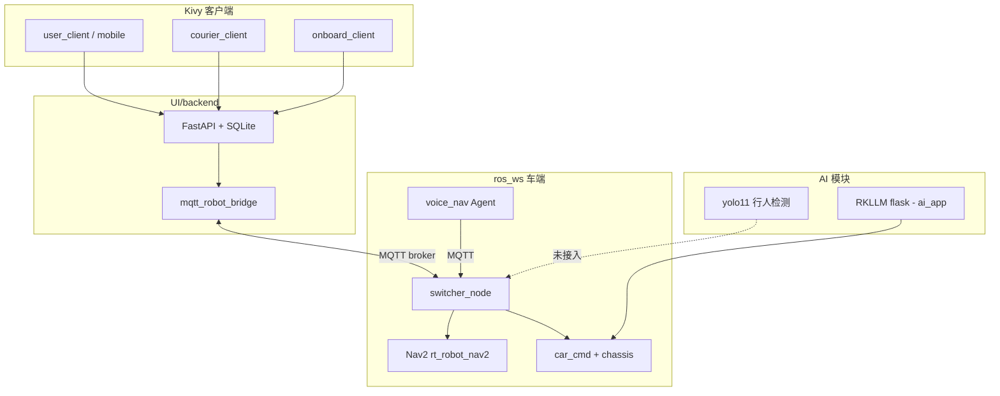

# NovaJoy 楼内智能配送 / 导览机器人 — 工程说明

> 工作区路径：`e:\New folder1\002`  
> 主工程包位于 **`1/`** 子目录，目标平台为 **RockPi 5B (RK3588) + Ubuntu 20.04**。

---

## 项目概览

| 能力 | 技术栈 |
|------|--------|
| 取货 / 送货业务 | FastAPI + SQLite + Kivy 多端 UI |
| 车端导航 | ROS2 Nav2 + 多楼层地图切换 |
| 云端 / 局域网调度 | MQTT（默认 `broker.emqx.io`） |
| 语音导览 | Sherpa STT + 知识库 QA + NavBridge |
| 大模型控车 | RKLLM（Qwen 微调 + 函数调用） |
| 行人检测 | YOLO11 RKNN（独立服务，未接入主流程） |

业务层详细文档见 [`1/UI/README.md`](1/UI/README.md)。

---

## 带注释的目录树

```
002-701/                                    # 工程根目录
├── README.md                           # 本文件
├── 01_安装环境.pdf                     # 培训文档：LlamaFactory + RKLLM 环境搭建
├── 02_训练并转换模型.pdf               # 培训文档：数据集生成、微调、RKLLM 量化转换
├── 03_如何控制小车.pdf                 # 培训文档：大模型 + ROS + 底盘联调流程
├── _pdf_extract.txt                    # 上述 PDF 的文本提取（便于检索）
│
└── Desktop/                                  # 主工程包（部署到 RockPi 的 Desktop）
    │
    ├── NovaJoy-启动后端.sh             # 桌面快捷入口 → UI/scripts/start_backend.sh
    ├── NovaJoy-取货端.sh               # → user_client
    ├── NovaJoy-送货端.sh               # → courier_client
    ├── NovaJoy-车载屏.sh               # → onboard_client（导览+送货集成屏）
    ├── NovaJoy-大模型控车.sh           # → ros_ws/scripts/run_ai_car_all.sh
    ├── NovaJoy-语音导览导航.sh         # → ros_ws/scripts/run_voice_nav_all.sh
    │
    ├── slam_mapping.sh                 # 建图模式：MicroROS + gmapping/slam_toolbox
    ├── start_multi_map.sh              # 多楼层导航一键启动（Nav2 + smart_switcher）
    ├── start_multi_map9.sh             # 同上变体
    ├── rock_ws.zip                     # 工作空间压缩包备份（microros 等可能需单独解压）
    │
    ├── UI/                             # 业务层：HTTP API + 全部 Kivy 客户端
    │   ├── README.md                   # 已有详细文档（取货/送货/车载/MQTT 联调）
    │   ├── requirements.txt
    │   ├── main.py                     # Buildozer 打包入口
    │   │
    │   ├── backend/                    # FastAPI 后端（已集成 MQTT 桥）
    │   │   ├── main.py                 # REST API 路由
    │   │   ├── database.py             # SQLite 持久化
    │   │   ├── state_machine.py        # 机器人内存状态机
    │   │   ├── task_manager.py         # 任务 CRUD + 状态流转
    │   │   ├── tour_manager.py         # 导览业务
    │   │   ├── mqtt_robot_bridge.py    # MQTT ↔ switcher_node 对齐
    │   │   ├── vehicle_rooms.py        # 房间号解析（与 switcher 同步）
    │   │   └── placeholder_requests.py # 占位：未来扩展业务类型（未启用）
    │   │
    │   ├── user_client/                # 取货端 PC/平板（Kivy 双列布局）
    │   ├── user_client_mobile/         # 取货端手机（Bottom Nav 五页 + APK 打包）
    │   ├── courier_client/             # 送货端（队列、投件、标记送达、回位）
    │   ├── onboard_client/             # 车载集成端（导览 Tab + 送货 Tab，横屏 1280×720）
    │   ├── novajoy_ui/                 # 共享 UI 设计系统（主题、组件、DESIGN_SYSTEM.md）
    │   ├── frontend/                   # 可选 Web 占位（user_app.html/js，非主 UI）
    │   ├── car_ui/                     # 已废弃入口，重定向到 courier_client
    │   ├── assets/                     # 品牌资源、字体
    │   ├── data/                       # 运行时 SQLite 等（空目录占位）
    │   ├── scripts/                    # 启动脚本、字体下载、APK 打包
    ├── ros_ws/                         # 车端 ROS2 工作空间（核心，UI 配置同步亦读此目录）
    │   ├── .git/                       # 独立 git 仓库
    │   ├── build/ install/ log/        # colcon 编译产物（已编译过）
    │   │
    │   ├── car_cmd.sh                  # 底盘速度命令 shell 接口
    │   ├── car_cmd_daemon.py           # 持续发布 Twist 的后台守护进程
    │   ├── usb_auto_setup.sh           # USB 串口 /dev/rt_shell 自动配置
    │   │
    │   ├── knowledge/                  # 语音导览知识库
    │   │   └── rooms.json              # 房间别名、介绍文案、楼层信息
    │   ├── knowledge.zip               # 知识库备份
    │   │
    │   ├── voice_nav/                  # 语音导览 Agent 模块（已集成）
    │   │   ├── agent.py                # 意图路由：QA / 导航 / 底盘运动
    │   │   ├── nav_bridge.py           # MQTT 导航桥
    │   │   ├── motion_bridge.py        # 大模型底盘运动（aichat）
    │   │   ├── kb_qa.py / retriever.py # 知识库检索问答
    │   │   ├── llm_intent.py           # LLM 意图识别
    │   │   ├── tts.py / stt_filter.py  # 语音合成 / STT 后处理
    │   │   └── session.py              # 对话会话状态
    │   ├── voice_nav.zip
    │   │
    │   ├── scripts/                    # 一键启动脚本集（36 个）
    │   │   ├── run_ai_car_all.sh       # 大模型控车四终端
    │   │   ├── run_voice_nav_all.sh    # 语音导览五终端（含 Nav2）
    │   │   ├── start_nav_stack_light.sh
    │   │   ├── voice_to_nav_agent.py   # STT → VoiceNavAgent
    │   │   ├── voice_to_ai_car.py      # STT → 大模型控车
    │   │   └── start_camera*.sh        # 相机 / 深度相机启动
    │   │
    │   ├── person_detect_rknn/         # 行人检测（独立工具，未接入主流程）
    │   │   ├── person_detect_window.py # 30 帧窗口检测
    │   │   ├── infer_rk3588_yolo11.py
    │   │   └── README.md
    │   │
    │   └── src/                        # ROS2 功能包
    │       ├── rt_robot_nav2/          # Nav2 导航栈 launch + 参数 + 地图目录
    │       ├── smart_nav_manager/      # 核心：switcher_node（MQTT 配送+导览+多楼层）
    │       │   └── switcher_node*.py   # 多个版本并存（主版本 switcher_node.py）
    │       ├── chassis_controller/     # 底盘 ROS 控制
    │       ├── lslidar_driver/         # 镭神 LS-N10P 激光雷达驱动
    │       ├── lslidar_msgs/           # 雷达消息定义
    │       ├── dm_imu/                 # IMU 驱动
    │       ├── depth_nav_assist/       # 深度相机 → LaserScan 辅助避障
    │       ├── robot_urdf/             # 多种车型 URDF 模型
    │       ├── slam_gmapping/          # gmapping SLAM 封装
    │       ├── openslam_gmapping/      # gmapping 底层库
    │       └── mqtt_nav_bridge/        # 旧版简单 MQTT→Nav2 桥（已被 switcher 取代）
    │
    ├── map/                            # 独立地图资源（与 install 内地图可能需手动同步）
    │   └── map/
    │       ├── my_map.yaml / .pgm      # 基础地图
    │       ├── my_map2~4.yaml / .pgm   # 多版本 / 多楼层地图
    │
    ├── yolo11/                         # YOLO11 行人检测 Web 服务（独立 Flask）
    │   ├── app.py                      # Flask + RKNN 实时检测 + 抓拍
    │   ├── yolo11n-rk3588.rknn         # 已转换的 RKNN 模型
    │   ├── infer_rk3588_yolo11*.py     # 推理脚本
    │   ├── captures/                   # 检测到行人时的抓拍目录
    │   └── templates/index.html        # Web 监控页
    │
    └── ai_app/                         # 大模型 AI 应用目录（当前几乎为空）
        └── RKSDK/
            └── .venv/                  # 仅有 Python 虚拟环境，缺少源码
                                        # PDF 要求解压 ai_app.zip 才有 test_rkllm_run 等
```

---

## 各模块职责

### `1/UI/` — 楼内取送货业务系统

- **backend**：用户注册登录、取货请求、送货队列、通知、机器人状态机；开启 `MQTT_BRIDGE_ENABLED=1` 时与车端 `switcher_node` 通过 MQTT 同步。
- **user_client / user_client_mobile**：用户端发起取货、密码验证取货。
- **courier_client**：送货员投件、标记送达、模拟回位。
- **onboard_client**：车载横屏，导览 + 送货双 Tab；`ONBOARD_MODE=api` 联真后端，`local` 仅练导览状态机。
- **novajoy_ui**：统一视觉规范（深色控制台风格）。

### `1/ros_ws/` — 车端 ROS2 与智能导航

- **rt_robot_nav2**：Nav2 定位 + 导航 launch、速度限制、RViz 配置。
- **smart_nav_manager / switcher_node**：系统中枢——订阅 MQTT `robot/{id}/request`，执行配送、导览、多楼层切图、电梯协调；发布 `robot/{id}/status` 心跳。
- **chassis_controller + car_cmd**：底盘速度控制链路。
- **lslidar_driver + dm_imu**：传感器驱动。
- **depth_nav_assist**：深度相机转 LaserScan，辅助窄道避障。
- **voice_nav**：语音问答 + 「带我去 101」类导航指令，读 `knowledge/rooms.json`，通过 MQTT 调 switcher。
- **scripts/**：RockPi 上一键拉起 MicroROS、底盘、Flask LLM、Nav2 等。

### `1/yolo11/` 与 `1/ros_ws/person_detect_rknn/`

两套独立的 **YOLO11 行人检测** 实现（RK3588 NPU），用于视频监控 / 安防告警，**尚未接入** 配送状态机或 Nav2 避障逻辑。

### `1/ai_app/` — 大模型控车

按 PDF 文档，应包含 `RKSDK/test_rkllm_run/`（`flask_server.py`、`aichat.py`）、微调后的 `.rkllm` 模型等。  
**当前仓库只有 `.venv`，源码缺失**，需在 RockPi 上解压 `ai_app.zip` 才能跑大模型控车。

### `1/map/` — 地图资源

PGM + YAML 栅格地图，供 Nav2 / switcher 加载。`switcher_node.py` 内硬编码路径为 `/home/rock/Desktop/rock_ws/ros_ws/install/...`，部署时需保证地图已 install 或路径一致。

### 根目录 PDF + 启动脚本

培训材料 + RockPi 桌面 `.sh` 快捷方式，默认路径为 `/home/rock/Desktop/UI` 和 `/home/rock/Desktop/rock_ws/ros_ws`。

---## 集成状态总览

### 已集成（可联调 / 已在脚本中串联）

| 模块 | 集成关系 |
|------|----------|
| **取货业务闭环** | user_client → FastAPI → SQLite 状态机 → courier_client 投件/送达/回位 |
| **MQTT B 方案** | backend `mqtt_robot_bridge` ↔ 车端 `switcher_node`（配送全流程） |
| **车载集成屏** | onboard_client ↔ FastAPI（导览 `tour_nav`、送货状态轮询） |
| **多楼层 Nav2** | switcher_node 动态 LoadMap + 房间坐标导航 |
| **语音导览** | Sherpa STT → voice_nav/agent → MQTT → switcher + TTS 播报 |
| **大模型控车脚本链** | run_ai_car_all.sh（MicroROS + 底盘 + Flask LLM + 语音）— **依赖 ai_app 源码** |
| **传感器栈** | 激光雷达 + IMU + 深度辅助 launch 脚本齐全 |
| **NovaJoy 桌面入口** | 6 个 `.sh` 对应后端 / 三端 UI / 大模型 / 语音导览 |

### 可能仍需集成 / 不完整 / 待补齐

| 模块 | 状态 | 说明 |
|------|------|------|
| **`ai_app/RKSDK` 源码** | 缺失 | 只有 `.venv`；需解压 `ai_app.zip`，含 `flask_server.py`、`aichat.py`、`.rkllm` 模型 |
| **`microros_ws`** | 外部依赖 | 不在本仓库，脚本假定 `~/Desktop/rock_ws/microros_ws` 已单独部署 |
| **Sherpa STT venv** | 外部依赖 | `run_voice_nav_all.sh` 需要 `~/Desktop/rk3588-offline-bundle/venv` |
| **YOLO 行人检测** | 独立运行 | `yolo11/`、`person_detect_rknn/` 未与 Nav2 / 业务状态机关联 |
| **`mqtt_nav_bridge` 包** | 遗留 | 简单 `robot/nav_goal` 主题，已被 `smart_nav_manager` 取代 |
| **`frontend/` Web UI** | 占位 | 仅 HTML/JS 草稿，非生产 UI |
| **`car_ui/`** | 废弃 | 仅打印提示，实际用 `courier_client` |
| **`placeholder_requests.py`** | 未实现 | 保洁、巡逻等扩展业务仅占位枚举 |
| **机器人状态持久化** | 未实现 | 重启 backend 后状态机回 `idle`（见 UI/README） |
| **送货端 API 鉴权** | 未实现 | 列为可选后续项 |
| **电梯 MQTT** | 半集成 | switcher 有 `elevator/request` 逻辑，需真实电梯系统对接 |
| **导览障碍检测** | UI 模拟 | onboard_client 中「模拟障碍」按钮，非真实传感器 |
| **`switcher_node1/2/Last.py`** | 实验副本 | 多版本并存，生产应只用 `switcher_node.py` |
| **地图路径** | 需对齐 | `map/`、`switcher_node` 内路径、`install/` 三处需手动一致 |
| **Buildozer APK** | 需 WSL | 手机 APK 打包文档完整，但需在 Linux/WSL 环境执行 |

---

## 典型启动路径（RockPi 上）

```bash
# 1. 楼内配送（服务器 + 客户端）
NovaJoy-启动后端.sh          # FastAPI :8000，默认 MQTT 桥已开
NovaJoy-取货端.sh            # 用户取货
NovaJoy-送货端.sh            # 送货员操作
NovaJoy-车载屏.sh            # 车载导览+送货屏

# 2. 车端导航栈（配送/导览真车）
start_multi_map.sh           # Nav2 + smart_switcher + MicroROS + 底盘

# 3. 语音导览（含 Nav2）
NovaJoy-语音导览导航.sh      # 5 终端：STT + 底盘 + MicroROS + LLM + Nav2

# 4. 大模型对话控车（需 ai_app 完整解压）
NovaJoy-大模型控车.sh        # 4 终端 + 语音对话
```

---

## 架构关系



---## 建议下一步

1. **补齐 `ai_app.zip`**：解压到 `1/ai_app/RKSDK/`，否则大模型控车脚本无法运行。
2. **确认外部工作空间**：`microros_ws`、`rk3588-offline-bundle` 是否已在目标板部署。
3. **按需集成 YOLO**：若要做「遇行人暂停导航」，需在 `switcher_node` 或 Nav2 层订阅检测结果。

---

## 相关文档

| 文档 | 路径 |
|------|------|
| 业务 API / MQTT 联调 | [`1/UI/README.md`](1/UI/README.md) |
| UI 设计规范 | [`1/UI/novajoy_ui/DESIGN_SYSTEM.md`](1/UI/novajoy_ui/DESIGN_SYSTEM.md) |
| 行人检测工具 | [`1/ros_ws/person_detect_rknn/README.md`](1/ros_ws/person_detect_rknn/README.md) |
| 环境 / 训练 / 控车培训 | `01_安装环境.pdf`、`02_训练并转换模型.pdf`、`03_如何控制小车.pdf` |