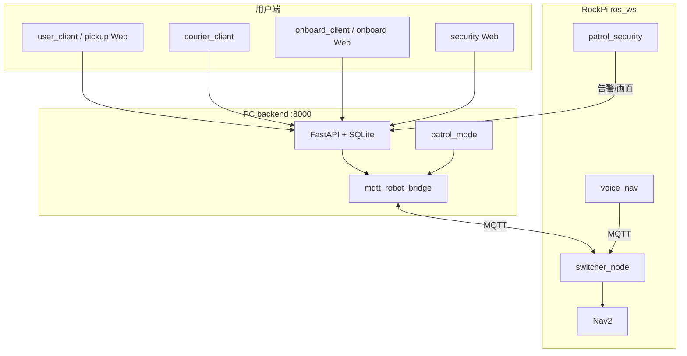

# NovaJoy 楼内智能配送 / 导览机器人

> 目标平台：**RockPi 5B (RK3588) + Ubuntu 20.04**  
> 源码仓库：https://github.com/W-123-cool/-

---

## 项目概览

| 能力 | 技术栈 |
|------|--------|
| 取货 / 送货业务 | FastAPI + SQLite + Kivy 多端 UI |
| Web 控制台 | 取货端 / 车载导览 / 保安总控（浏览器访问） |
| 车端导航 | ROS 2 Nav2 + 多楼层地图切换 |
| 局域网调度 | MQTT（默认 `broker.emqx.io`） |
| 语音导览 | Sherpa STT + 知识库 QA + NavBridge |
| 大模型控车 | RKLLM（Qwen 微调 + 函数调用） |
| 保安巡逻 | 巡逻模式状态机 + 视觉告警 + GUARD/PATROL |
| 行人检测 | YOLO11 RKNN（独立工具，可配合巡逻视觉） |

业务层 API 与 MQTT 联调详见 [`Desktop/UI/UI/README.md`](Desktop/UI/UI/README.md)。

---

## 部署前准备

### 仓库克隆

```bash
git clone git@github.com:W-123-cool/-.git
# 或
git clone https://github.com/W-123-cool/-.git
```

### 目录部署（RockPi 车端）

将仓库中的 `Desktop/` 内容按下列方式放到板子上（路径与启动脚本一致）：

| 仓库路径 | RockPi 目标路径 |
|----------|-----------------|
| `Desktop/UI/UI/` | `/home/rock/Desktop/UI/` |
| `Desktop/ros_ws/` | `/home/rock/Desktop/rock_ws/ros_ws/` |
| `Desktop/*.sh` 快捷脚本 | `/home/rock/Desktop/` |

### 外部依赖（不在本仓库，需单独准备）

| 依赖 | 路径 | 用途 |
|------|------|------|
| `microros_ws` | `~/Desktop/rock_ws/microros_ws` | MicroROS Agent，底盘通信 |
| `rk3588-offline-bundle` | `~/Desktop/rk3588-offline-bundle/` | Sherpa STT/TTS、唤醒词模型 |
| `ai_app.zip` 解压内容 | `~/Desktop/ai_app/RKSDK/` | 大模型控车（`flask_server.py`、`aichat.py`、`.rkllm`） |

语音模型包、RKNN 权重等大文件未纳入 Git，克隆后需在车端自行拷贝。

### PC 端 Python 环境

```powershell
cd Desktop\UI\UI
python -m venv .venv
.\.venv\Scripts\activate
pip install -r requirements.txt
python scripts\download_fonts.py
```

---

## 带注释的目录树

```
002-701/                                    # 工程根目录
├── README.md                               # 本文件
├── GITHUB_UPLOAD.md                        # Git 上传说明
├── 01_安装环境.pdf                         # 培训：LlamaFactory + RKLLM 环境
├── 02_训练并转换模型.pdf                   # 培训：微调与 RKLLM 量化
├── 03_如何控制小车.pdf                     # 培训：大模型 + ROS + 底盘联调
├── _pdf_extract.txt                        # PDF 文本提取（便于检索）
│
└── Desktop/                                # 主工程包
    │
    ├── NovaJoy-启动后端.sh                 # → UI/scripts/start_backend.sh
    ├── NovaJoy-取货端.sh                   # → user_client
    ├── NovaJoy-送货端.sh                   # → courier_client
    ├── NovaJoy-车载屏.sh                   # → onboard_client
    ├── NovaJoy-大模型控车.sh               # → ros_ws/scripts/run_ai_car_all.sh
    ├── NovaJoy-语音导览导航.sh             # → ros_ws/scripts/run_voice_nav_all.sh
    │
    ├── slam_mapping.sh                     # 建图：MicroROS + gmapping
    ├── start_multi_map.sh                  # 多楼层导航（Nav2 + smart_switcher）
    ├── start_multi_map9.sh                 # 同上变体
    │
    ├── UI/UI/                              # 业务层：HTTP API + Kivy + Web 前端
    │   ├── README.md                       # 业务 API / MQTT 详细说明
    │   ├── requirements.txt
    │   ├── backend/                        # FastAPI 后端 + MQTT 桥
    │   │   ├── main.py                     # REST 路由
    │   │   ├── database.py                 # SQLite
    │   │   ├── state_machine.py            # 机器人状态机
    │   │   ├── task_manager.py             # 取送货任务
    │   │   ├── tour_manager.py             # 导览业务
    │   │   ├── mqtt_robot_bridge.py        # MQTT ↔ switcher_node
    │   │   ├── patrol_mode/                # 保安巡逻模式（状态机、地图、告警）
    │   │   └── vehicle_rooms.py            # 房间号解析
    │   ├── user_client/                    # 取货端 PC/平板（Kivy）
    │   ├── user_client_mobile/             # 取货端手机（Kivy / APK）
    │   ├── courier_client/                 # 送货端（Kivy）
    │   ├── onboard_client/                 # 车载屏（导览 + 送货 Tab）
    │   ├── frontend/                       # Web：pickup / onboard / security
    │   ├── novajoy_ui/                     # 共享 UI 设计系统
    │   ├── assets/                         # 品牌资源、字体
    │   ├── data/                           # 运行时 SQLite（app.db 不入库）
    │   └── scripts/                        # 启动脚本、APK 打包
    │
    ├── ros_ws/                             # 车端 ROS 2 工作空间
    │   ├── car_cmd.sh / car_cmd_daemon.py  # 底盘速度命令
    │   ├── usb_auto_setup.sh               # USB 串口配置
    │   ├── knowledge/rooms.json            # 语音导览知识库
    │   ├── voice_nav/                      # 语音导览 Agent
    │   │   ├── agent.py                    # 意图路由：QA / 导航 / 运动
    │   │   ├── nav_bridge.py               # MQTT 导航桥
    │   │   ├── tts.py / audio_preprocess.py
    │   │   └── wake.py                     # 唤醒词检测
    │   ├── scripts/                        # 一键启动脚本
    │   │   ├── run_voice_nav_all.sh        # 语音导览（含 Nav2）
    │   │   ├── run_ai_car_all.sh           # 大模型控车
    │   │   ├── start_nav.sh / start_multi_map 配套
    │   │   ├── voice_to_nav_agent.py       # STT → VoiceNavAgent
    │   │   └── start_patrol_security.sh    # 巡逻视觉节点
    │   ├── person_detect_rknn/             # YOLO11 行人检测工具
    │   └── src/                            # ROS 2 功能包
    │       ├── rt_robot_nav2/              # Nav2 launch + 地图 + 参数
    │       ├── smart_nav_manager/          # switcher_node（MQTT 中枢）
    │       ├── patrol_security/            # 巡逻视觉、GUARD 跟踪、追人
    │       ├── chassis_controller/         # 底盘 ROS 控制
    │       ├── lslidar_driver/             # 镭神 LS-N10P 激光雷达
    │       ├── dm_imu/                     # IMU
    │       ├── depth_nav_assist/           # 深度相机 → LaserScan
    │       ├── slam_gmapping/              # gmapping SLAM
    │       └── robot_urdf/                 # 车型 URDF
    │
    ├── map/                                # 地图资源（PGM + YAML）
    │   ├── map/                            # 基础 / 多楼层地图
    │   └── patrol_planner/                 # 巡逻路径规划 UI
    │
    ├── yolo11/                             # YOLO11 Flask 检测服务（独立）
    └── ai_app/RKSDK/                       # 大模型控车（需解压 ai_app.zip 补全）
```

---

## 各模块说明

### `Desktop/UI/UI/` — 楼内取送货与 Web 控制台

- **backend**：用户注册登录、取货请求、送货队列、导览、机器人状态机；`MQTT_BRIDGE_ENABLED=1` 时通过 MQTT 与车端 `switcher_node` 同步。
- **patrol_mode/**：保安巡逻模式（排班、地图同步、告警、GUARD/PATROL 状态机），Web 总控见 `/security`。
- **user_client / user_client_mobile**：Kivy 取货端（PC/平板/手机）。
- **courier_client**：Kivy 送货端（投件、送达、回位）。
- **onboard_client**：Kivy 车载横屏（导览 + 送货）；`ONBOARD_MODE=api` 联真后端，`local` 仅本地测时序。
- **frontend/**：浏览器入口，无需安装 APK（见下文 Web 地址）。

### `Desktop/ros_ws/` — 车端 ROS 2 与智能导航

- **smart_nav_manager / switcher_node.py**：系统中枢，订阅 MQTT `robot/{id}/request`，执行配送、导览、多楼层切图；发布 `robot/{id}/status`。
- **rt_robot_nav2**：Nav2 定位导航 launch、速度限制、RViz。
- **patrol_security**：巡逻视觉（YOLO + MJPEG）、GUARD 视角跟踪、PATROL 追人辅助。
- **voice_nav**：Sherpa STT → 意图识别 → MQTT 导航 / 知识库问答 + TTS 播报。
- **scripts/**：RockPi 上一键拉起 MicroROS、底盘、Nav2、语音、巡逻视觉等。

### `Desktop/map/` — 地图与巡逻规划

栅格地图（PGM/YAML）供 Nav2 与 switcher 加载；`patrol_planner/` 提供巡逻航点规划 Web UI。

### `Desktop/yolo11/` 与 `person_detect_rknn/`

两套 YOLO11 RKNN 行人检测实现，可独立运行；巡逻模式通过 `patrol_security` 包接入主流程。

### `Desktop/ai_app/` — 大模型控车

需将 `ai_app.zip` 解压到 `RKSDK/`，包含 `flask_server.py`、`aichat.py` 及 `.rkllm` 模型后，`NovaJoy-大模型控车.sh` 方可运行。

---

## 快速启动

### 一、PC 后端 + Web 端

```powershell
cd Desktop\UI\UI\backend
$env:MQTT_BRIDGE_ENABLED="1"
python -m uvicorn main:app --host 0.0.0.0 --port 8000
```

浏览器访问（将 `<PC_IP>` 换成本机局域网 IP）：

| 页面 | URL |
|------|-----|
| 取货端（手机 Web） | `http://<PC_IP>:8000/pickup` |
| 车载导览控制台 | `http://<PC_IP>:8000/onboard?tab=tour` |
| 保安总控 | `http://<PC_IP>:8000/security` |

### 二、PC 本地 Kivy 客户端

```powershell
cd Desktop\UI\UI
python -m user_client.main          # 取货端
python -m courier_client.main       # 送货端
python -m onboard_client.main       # 车载屏
```

API 地址默认 `http://127.0.0.1:8000`，跨机联调时在各客户端设置 `PICKUP_API_BASE` / `COURIER_API_BASE`。

### 三、RockPi 车端导航（配送 / 导览）

```bash
# 终端 1：Nav2 + smart_switcher + 传感器
bash ~/Desktop/start_multi_map.sh
# 按提示在终端 2 用 minicom 连接底盘

# 终端 3（PC 已启后端且 MQTT 桥开启）：可选启送货业务
```

车端 API 地址配置（语音/车载 Web 联 PC 后端）：

```bash
cp ~/Desktop/rock_ws/ros_ws/scripts/onboard_api.env.example \
   ~/Desktop/rock_ws/ros_ws/scripts/onboard_api.env
# 编辑 COURIER_API_BASE=http://<PC局域网IP>:8000
```

### 四、语音导览（含 Nav2）

```bash
bash ~/Desktop/NovaJoy-语音导览导航.sh
```

依赖：`rk3588-offline-bundle/venv`（Sherpa STT/TTS）、AB13X USB 麦克风、Nav2 已就绪。

### 五、大模型控车

```bash
bash ~/Desktop/NovaJoy-大模型控车.sh
```

依赖：`ai_app/RKSDK/` 完整解压、`microros_ws`、底盘 minicom。

### 六、保安巡逻模式

```bash
# PC：后端已启动，浏览器打开 /security，PIN 默认见 patrol_mode 配置

# 车端：Nav2 就绪后
cd ~/Desktop/rock_ws/ros_ws
colcon build --packages-select patrol_security smart_nav_manager
source install/setup.bash
export PATROL_SNAPSHOT_URL="http://<PC_IP>:8000/api/security/snapshot"
bash scripts/start_patrol_security.sh
```

验收步骤见 `Desktop/UI/UI/docs/P1a-验收步骤.md` 等文档。

### 七、SLAM 建图

```bash
bash ~/Desktop/slam_mapping.sh
```

---

## 典型业务数据流



---

## 语音栈模型（车端）

| 方向 | 模型 | 路径 |
|------|------|------|
| STT | Sherpa Zipformer-small 流式中英 | `rk3588-offline-bundle/model/sherpa-onnx-rk3588-streaming-zipformer-small-bilingual-zh-en-2023-02-16` |
| TTS | Matcha-icefall-zh-baker + Vocos | `rk3588-offline-bundle/model/matcha-icefall-zh-baker` |
| 唤醒 | Sherpa KWS Zipformer 3.3M | `rk3588-offline-bundle/model/sherpa-onnx-kws-zipformer-wenetspeech-3.3M-2024-01-01-mobile` |

---

## 相关文档

| 文档 | 路径 |
|------|------|
| 业务 API / MQTT 联调 | [`Desktop/UI/UI/README.md`](Desktop/UI/UI/README.md) |
| Web 前端入口 | [`Desktop/UI/UI/frontend/readme.md`](Desktop/UI/UI/frontend/readme.md) |
| UI 设计规范 | [`Desktop/UI/UI/novajoy_ui/DESIGN_SYSTEM.md`](Desktop/UI/UI/novajoy_ui/DESIGN_SYSTEM.md) |
| 保安巡逻计划 | [`Desktop/UI/UI/docs/保安总控巡逻模式计划.md`](Desktop/UI/UI/docs/保安总控巡逻模式计划.md) |
| 行人检测工具 | [`Desktop/ros_ws/person_detect_rknn/README.md`](Desktop/ros_ws/person_detect_rknn/README.md) |
| 巡逻路径规划 | [`Desktop/map/patrol_planner/README.md`](Desktop/map/patrol_planner/README.md) |
| 环境 / 训练 / 控车培训 | `01_安装环境.pdf`、`02_训练并转换模型.pdf`、`03_如何控制小车.pdf` |
