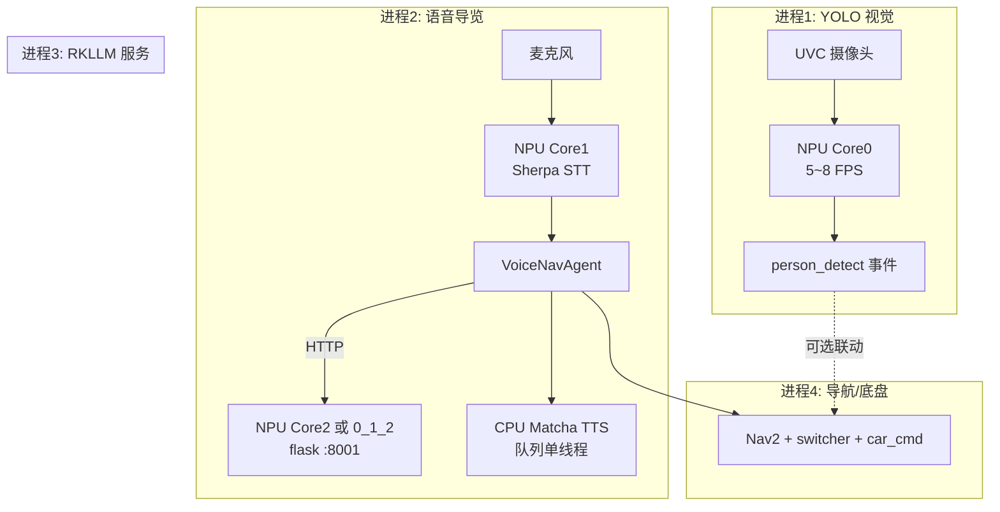

你这个问题本质是：**多模型同时在线，但 NPU/内存/带宽有限，不能「全开满负载」**。下面给一个按你们现有栈（YOLO + Sherpa STT + Matcha TTS + RKLLM）设计的**可落地例子**。

（你写的「文字转语音」我按 **STT 语音识别 + TTS 语音合成** 理解；若还包含 LLM，也一并纳入。）

---

## 核心原则：分域 + 分核 + 限流 + 错峰

| 资源 | 谁用 | 策略 |
|------|------|------|
| NPU Core 0 | YOLO（持续、低优先级） | 固定绑核 + 降帧 |
| NPU Core 1 | Sherpa STT（实时） | 固定绑核，独占 |
| NPU Core 2 / 多核 | RKLLM（按需、突发） | 说话时 LLM 优先，YOLO 让路 |
| CPU | TTS Matcha、Nav2、Flask | **TTS 放 CPU**（你们代码已默认） |
| DDR 内存 | 全部 | 分批加载，控制模型体积 |

你们项目里 TTS 已经默认走 CPU，这是对的：

```98:99:Desktop/ros_ws/voice_nav/tts.py
    num_threads = int(os.environ.get("SHERPA_TTS_NUM_THREADS", "2"))
    provider = os.environ.get("SHERPA_TTS_PROVIDER", "cpu").strip() or "cpu"
```

YOLO 目前是 `NPU_CORE_AUTO` 全速跑，多模型并存时容易和 STT/LLM 抢 NPU：

```131:131:Desktop/yolo11/app.py
    if rknn.init_runtime(core_mask=RKNNLite.NPU_CORE_AUTO) != 0:
```

---

## 推荐架构（4 进程，互不拖垮）



**关键：不是「所有模型同时满负载推理」，而是「都在线，但峰值错开」。**

---

## 具体配置示例（RockPi 8GB）

### 1. 统一环境脚本 `multi_ai_env.sh`

```bash
#!/usr/bin/env bash
# 多模型并存 — 资源分配

# ── YOLO：核0，降帧 ──
export YOLO_NPU_CORE=1          # RKNNLite.NPU_CORE_0
export YOLO_TARGET_FPS=6        # 不要 30fps，6fps 安防够用
export YOLO_INPUT_SIZE=416      # 可选：从 640 降到 416 省 NPU/带宽

# ── STT：核1 ──
export SHERPA_PROVIDER=rknn
export SHERPA_NPU_CORE=2        # NPU_CORE_1（需在 sherpa 或 wrapper 里设置）

# ── TTS：CPU，少线程 ──
export VOICE_NAV_TTS_BACKEND=sherpa
export SHERPA_TTS_PROVIDER=cpu
export SHERPA_TTS_NUM_THREADS=2
export SHERPA_TTS_MAX_SENTENCES=1   # 一次只合成一句

# ── LLM：按需，纯本地 ──
export VOICE_NAV_BACKEND=local
export VOICE_NAV_USE_LLM=1
export AI_CAR_LLM_HOST=http://127.0.0.1:8001
# RKLLM 侧建议绑核2或独占多核（在 flask 启动参数/源码里设）

# ── 错峰：说话时 YOLO 让路 ──
export YOLO_PAUSE_ON_SPEECH=1   # 自定义逻辑，见下文

# ── 内存保护 ──
export MALLOC_ARENA_MAX=2       # 减少 glibc 内存碎片
ulimit -v 6000000 2>/dev/null || true  # 软限制虚拟内存 ~6GB（可选）
```

### 2. YOLO 改法（最重要）

在 `app.py` 的 `detector_loop` 里做三件事：

```python
# 伪代码 — 三处改动
CORE_MAP = {1: RKNNLite.NPU_CORE_0, 2: RKNNLite.NPU_CORE_1, 4: RKNNLite.NPU_CORE_2}
core = CORE_MAP.get(int(os.environ.get("YOLO_NPU_CORE", "1")), RKNNLite.NPU_CORE_0)
rknn.init_runtime(core_mask=core)

target_fps = float(os.environ.get("YOLO_TARGET_FPS", "8"))
frame_interval = 1.0 / target_fps

while running:
    t0 = time.time()
    ok, frame = cap.read()
    # ... inference ...
    elapsed = time.time() - t0
    sleep_time = frame_interval - elapsed
    if sleep_time > 0:
        time.sleep(sleep_time)  # 限帧，避免占满 NPU
```

**效果**：YOLO 从「占满 AUTO 调度」变成「Core0 上 6~8 FPS 背景任务」。

### 3. 启动顺序（避免一启动就 OOM）

```bash
# ① 先起 LLM（最重，单独占 NPU，等 init success）
cd ~/Desktop/ai_app/RKSDK/test_rkllm_run && python3 flask_server.py &
sleep 15   # 等到 rkllm init success

# ② 再起 YOLO（轻量视觉）
cd ~/Desktop/yolo11 && YOLO_NPU_CORE=1 YOLO_TARGET_FPS=6 python3 app.py &

# ③ 再起导航栈（CPU 为主）
bash ~/Desktop/rock_ws/ros_ws/scripts/start_nav_stack_light.sh &

# ④ 最后起语音（STT + TTS + 调 LLM）
source ~/Desktop/rk3588-offline-bundle/venv/bin/activate
source multi_ai_env.sh
python3 ~/Desktop/rock_ws/ros_ws/scripts/voice_to_nav_agent.py
```

**不要 4 个模型同时 `load_rknn/init_runtime`**，分批启动，每步确认内存：

```bash
free -h
cat /sys/kernel/debug/rknpu/load   # 看三核负载
```

### 4. 错峰调度（高效且不崩的关键）

典型交互时间线：

```
用户说话 ──► STT(Core1) 持续占用
用户停顿 ──► STT 结束 ──► LLM(Core2) 推理 1~3s  ◄── 此时 YOLO 暂停或降到 2fps
LLM 返回 ──► TTS(CPU) 播报 2~5s          ◄── YOLO 可恢复 6fps
```

实现方式（简单版）：

- 在 `voice_to_nav_agent.py` 识别到 `is_final` 时，写文件 `/tmp/yolo_pause`  
- YOLO 循环里检测该文件，存在则 `sleep(0.1)` 跳过推理  
- TTS 播完删除该文件  

这样 **LLM 推理峰值时 NPU 不会被 YOLO 抢**，崩溃概率大幅下降。

你们 TTS 已有队列单 worker（`_tts_queue`），天然不会并发合成，保持即可。

---

## 各模型「安全参数」参考

| 模型 | 建议 | 原因 |
|------|------|------|
| YOLO11n | 6~8 FPS，Core0，416 或 640 | 视觉不需要 30fps |
| Sherpa STT small | Core1，`num_threads=1` | 流式识别要稳定低延迟 |
| Matcha TTS | **CPU**，2 线程 | 不占 NPU，与 STT 并行 |
| RKLLM 1.5B~3B | 按需调用，Core2 或三核 | 只在用户说完话后调用一次 |
| Nav2 | CPU + 少量 GPU 无关 | 与 NPU 基本不冲突 |

**8GB 板子模型组合上限（经验值）**：

- YOLOn + STT-small + TTS(CPU) + LLM≤3B：**可以稳跑**  
- 再加第二个 YOLO / 更大 LLM(7B+) / 高帧率：**容易 swap 或 NPU submit 失败**

---

## 崩溃前兆与防护

| 现象 | 原因 | 处理 |
|------|------|------|
| `failed to submit! op Conv` | NPU 驱动/多核冲突 | 升级 NPU 驱动 ≥0.9.6，固定 core_mask |
| `Killed` / OOM | 内存不够 | 降 YOLO 帧率、换小 LLM、加 swap(2GB) |
| STT 延迟变大 | YOLO/LLM 抢 NPU | YOLO 限帧 + 说话时暂停 YOLO |
| TTS 卡顿 | CPU 被 Nav2 占满 | TTS 线程绑 CPU 大核，`nice -n -5` |
| 整体假死 | 全满载 | 设优先级：STT > LLM > YOLO |

监控命令：

```bash
watch -n1 'free -h; echo ---; cat /sys/kernel/debug/rknpu/load 2>/dev/null'
```

---

## 降级策略（保证「不崩」比「全功能」更重要）

按优先级自动降级：

1. **LLM 超时** → 切 `VOICE_NAV_BACKEND=rules`（规则+知识库，不占 NPU）  
2. **NPU 负载 >80% 持续 5s** → YOLO 自动降到 2 FPS  
3. **free 内存 <500MB** → 停 YOLO Web 预览，只保留检测  
4. **TTS 初始化失败** → 已有 espeak 降级（你们 `tts.py` 支持）

---

## 一句话总结

> **高效且不崩 = NPU 分核（YOLO@0, STT@1, LLM@2）+ TTS 放 CPU + YOLO 限帧 + 说话/思考时 YOLO 让路 + 分批启动 + 内存监控。**

不是让 5 个模型「同时满速跑」，而是让它们 **同时在线、峰值错开、各守各的核**。

如果你希望，我可以直接在仓库里改一版：
1. `yolo11/app.py` 支持 `YOLO_NPU_CORE` / `YOLO_TARGET_FPS` / `YOLO_PAUSE_FILE`  
2. 新增 `scripts/start_multi_ai_safe.sh` 一键按上述顺序启动